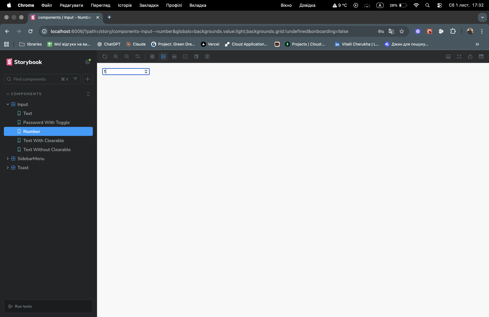
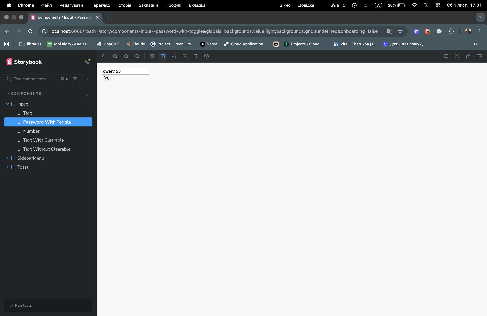
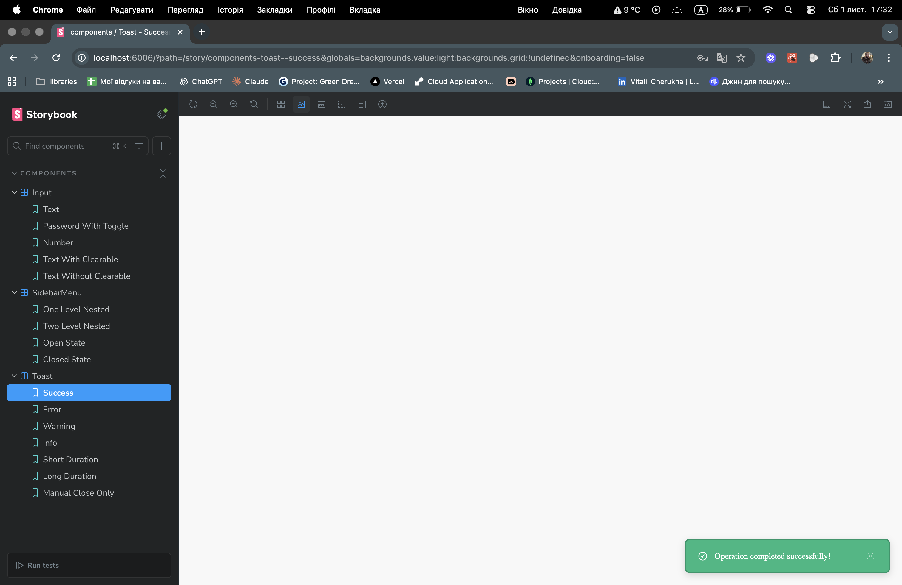
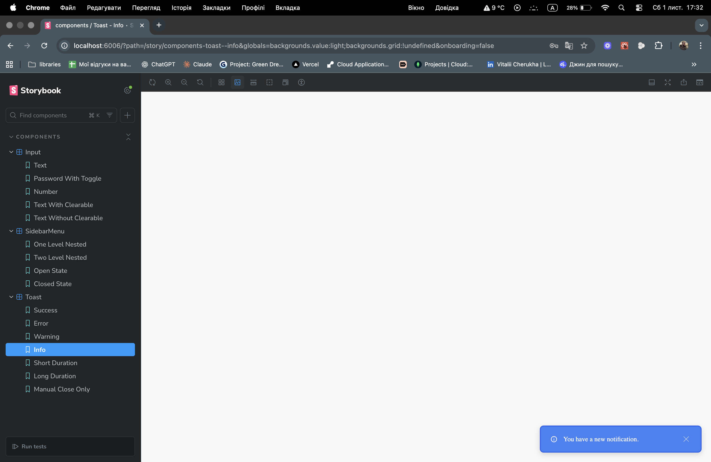
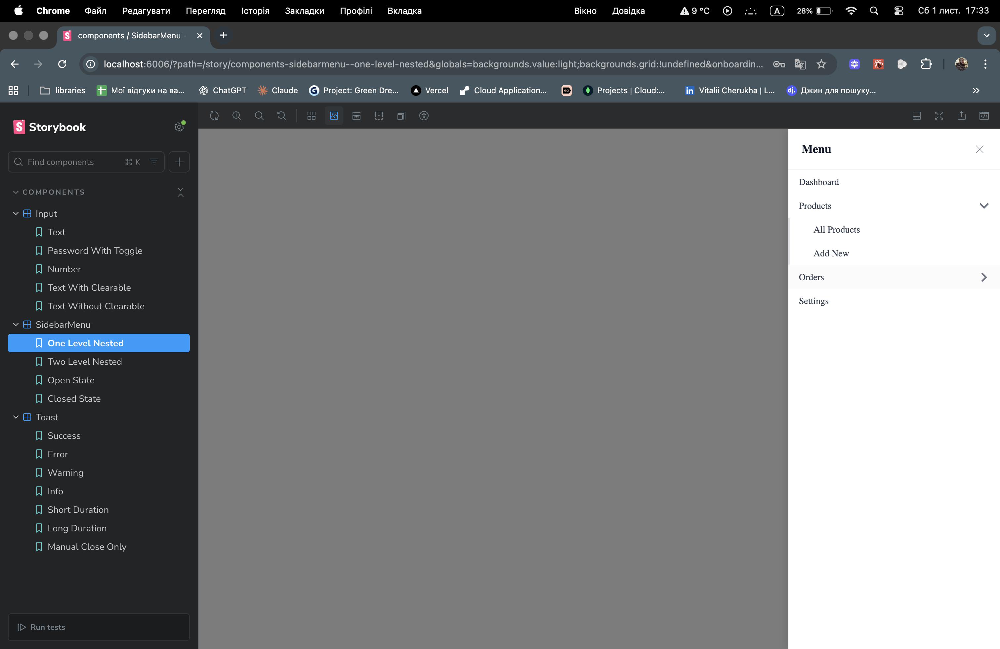
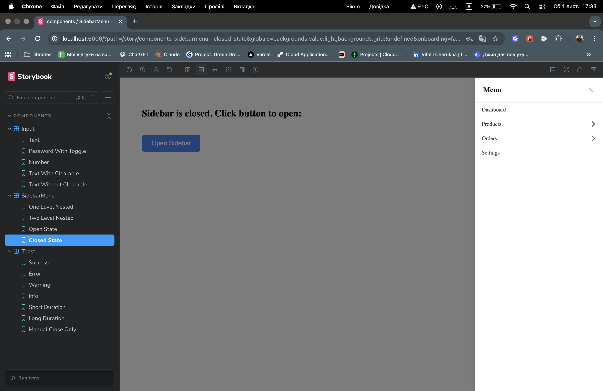

# 🧩 React TA — Component Library (Storybook)

A compact React component library featuring three reusable UI components — Input, Toast, and SidebarMenu — all documented and demonstrated in Storybook.

## 🚀 Getting Started

```
npm install
npm run storybook
```

Storybook will be available at http://localhost:6006
.

## 🧱 Project Structure

```
src/components/
├─ Input/
├─ Toast/
└─ SidebarMenu/
public/images/
```

## 🧠 Components Overview

📥 Input

Supports multiple types: text, number, password

clearable prop to show a small “×” button

Visibility toggle for password type

🔔 Toast
Appears in the bottom-right corner
Supports multiple variants: success, info
Auto-dismiss after configurable duration
Optional manual close button

📚 SidebarMenu
Slides in from the right with overlay background
Supports nested (one-level or two-level) menus
Closes on overlay click or ESC key press

## 🖼️ Component Screenshots

Screenshots (з `public/images`):

- Input — number field
  

- Input — password (visibility toggle)
  

- Toast — success (auto-dismiss)
  

- Toast — info variant
  

- Sidebar — open (one-level)
  

- Sidebar — closed state
  
